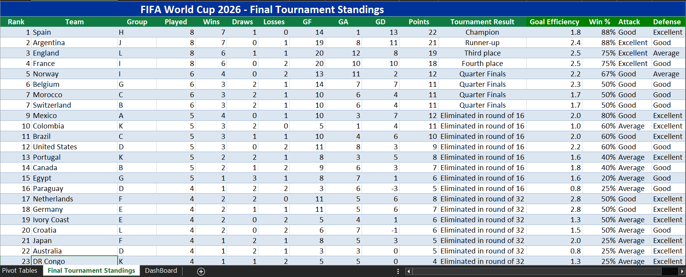
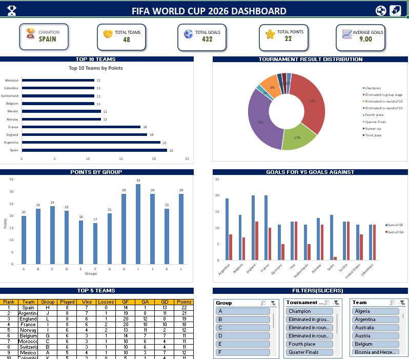

# ⚽ FIFA World Cup 2026 Dashboard

## 📖 Project Overview

This project was created to apply the Excel concepts I have learned so far by working with a real-world dataset.

Using the FIFA World Cup 2026 Final Tournament Standings, I built an interactive dashboard that transforms raw data into meaningful insights through charts, KPIs, and filters.

## 📊 Dashboard Preview

## 🛠 Tools & Features

- Microsoft Excel
- Power Query
- Excel Tables
- Pivot Tables
- Pivot Charts
- KPI Cards
- Slicers (Interactive Filters)
- Data Visualization

## 📈 Dashboard Highlights

- 🏆 Champion
- 🌍 Total Teams
- ⚽ Total Goals
- ⭐ Highest Points
- 📊 Top 10 Teams by Points
- 🥧 Tournament Result Distribution
- 📈 Points by Group
- ⚽ Goals For vs Goals Against
- 🏅 Top 5 Teams

## 🌱 Learning Outcome

This project helped me apply the Excel concepts I have learned so far in a practical way. It improved my understanding of data cleaning, analysis, dashboard design, and presenting insights through interactive visualizations.

As I continue learning, I look forward to building more advanced analytics projects using Excel, Power Query, SQL, and Power BI.

## 💬 Feedback

Suggestions and feedback are always welcome. Thank you for taking the time to view my project!

### 👩‍💻 Created by

**Geethika**
